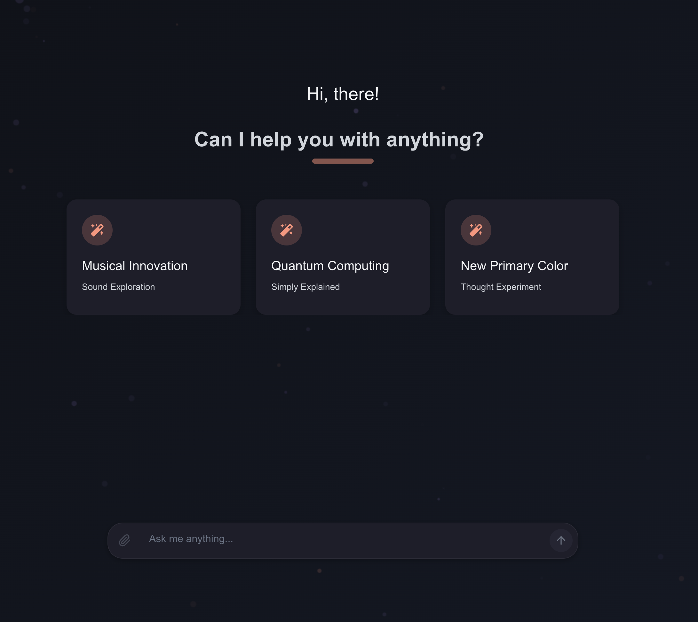

# Next LM Chat

A modern, responsive chat interface for local language models using Next.js. This project provides an OpenAI-compatible API client that can connect to various LLM backends, with a beautiful and intuitive chat interface. Developed and maintained by [A14A B.V.](https://github.com/a14a-org).



## Features

- 🔄 **OpenAI-compatible API**: Works with any backend that implements the OpenAI API spec
- 💬 **Modern Chat Interface**: Clean, responsive design with animations and intuitive UX
- 🪄 **Magical UI Elements**: Particle effects and subtle animations enhance the user experience
- 🌐 **Next.js Application**: Built with the latest Next.js features for optimal performance
- 📱 **Fully Responsive**: Works seamlessly on mobile, tablet, and desktop
- 🧩 **Modular Components**: Built with reusability and maintainability in mind
- 🌓 **Dark Mode Support**: Toggle between light and dark themes for comfortable viewing in any environment

## Getting Started

### Prerequisites

- Node.js 18.x or later
- npm or yarn

### Installation

1. Clone the repository:

   ```bash
   git clone https://github.com/a14a-org/next-lm-chat.git
   cd next-lm-chat
   ```

2. Install dependencies:

   ```bash
   npm install
   # or
   yarn install
   ```

3. Create a `.env.local` file in the root directory with your environment variables:

   ```
   # Copy from .env.example and set your values
   cp .env.example .env.local
   ```

4. Configure your environment variables in `.env.local`:
   ```
   LM_STUDIO_API_KEY=your_api_key_here
   LM_STUDIO_API_URL=https://your-api-url.com/v1
   ```

### Development

Run the development server:

```bash
npm run dev
# or
yarn dev
```

Open [http://localhost:3000](http://localhost:3000) with your browser to see the result.

## Environment Variables

| Variable                    | Description                | Default                |
| --------------------------- | -------------------------- | ---------------------- |
| `LM_STUDIO_API_KEY`         | API key for authentication | None (Required)        |
| `LM_STUDIO_API_URL`         | Base URL for the API       | https://example.com/v1 |
| `NEXT_PUBLIC_APP_NAME`      | Application name           | Next LM Chat           |
| `NEXT_PUBLIC_DEFAULT_MODEL` | Default model to use       | local-model            |

## Project Structure

```
next-lm-chat/
├── public/           # Static assets
├── src/              # Source code
│   ├── app/          # Next.js app router pages
│   ├── components/   # React components
│   ├── types/        # TypeScript type definitions
│   └── utils/        # Utility functions
├── .env.example      # Example environment variables
└── README.md         # Project documentation
```

## API Compatibility

This project implements an OpenAI-compatible API client, supporting the following endpoints:

- `/v1/chat/completions` - Chat completions API
- `/v1/completions` - Text completions API
- `/v1/models` - List available models
- `/v1/embeddings` - Generate embeddings

## Contributing

Contributions are welcome! Please feel free to submit a Pull Request.

1. Fork the repository from [GitHub](https://github.com/a14a-org/next-lm-chat)
2. Create your feature branch (`git checkout -b feature/amazing-feature`)
3. Commit your changes (`git commit -m 'Add some amazing feature'`)
4. Push to the branch (`git push origin feature/amazing-feature`)
5. Open a Pull Request

## License

This project is licensed under the MIT License - see the [LICENSE](LICENSE) file for details.

## Acknowledgments

- [Next.js](https://nextjs.org/) - The React Framework
- [React](https://reactjs.org/) - A JavaScript library for building user interfaces
- [Tailwind CSS](https://tailwindcss.com/) - A utility-first CSS framework

## Dark Mode

Next LM Chat includes a fully-featured dark mode that can be toggled via the settings menu (cog icon). The dark mode implementation:

- Automatically detects and applies the user's system preference on first load
- Persists the user's theme preference across sessions using local storage
- Provides a smooth transition between light and dark themes
- Ensures proper contrast and readability in both themes
- Adapts all UI components including messages, cards, and inputs

The dark theme is designed to reduce eye strain in low-light environments while maintaining the aesthetic appeal of the application.
